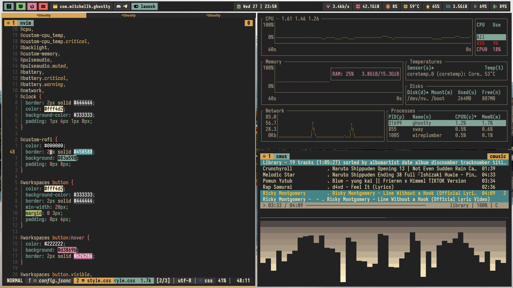

# My workstation configs

- The colorscheme is a combmination of both gruvbox and gruvbox-material in my configs

## **Descriptions:**

- **OS:** Arch Linux
- **Window Manager:** i3,swaywm,hyprland
- **Bar:** polybar,waybar
- **Launcher:** rofi
- **Compositor:** picom (for xorg)
- **Terminal:** ghostty
- **Code Editor** : Neovim
- **Lockscreen:** i3lock,swaylock,hyprlock
- **File Manager:** nemo
- **Fonts:** jetbrainsmono nerd font, roboto-condensed, font-awesome, iosevkaterm nerd font
- **Policykit:** mate-polkit

## Installation script :

```sh
curl -s https://raw.githubusercontent.com/bibjaw99/workstation/refs/heads/master/install_scripts/install.sh | bash
```

- if you already finished the base arch installation just clone the repo
- got `$HOME/github/workstation/install_scripts/`
- run the `install.sh` script
- before installing you can check the list of the Packages in the install_scripts directory and modify it according to your likings

# Notes ⚠️

[Important Notes](./arch_install/notes/notes.md)

[Wayland Notes](./arch_install/notes/wayland_notes.md)

[Arch Installation Process I followed](./arch_install/notes/archInstalltion.md)

### Drivers:

##### Currently using an ultrabook: HP probook 10 G450, i5 13th gen with iGPU - intel iris xe.

```sh
# intel
xorg
xf86-video-amdgpu
xf86-video-ati
amd-ucode
amdvlk

# amd
intel-media-driver
vulkan-intel
intel-gmmlib
```

---

## Apps in each workspace

| Workspace Number |   Assigned Apps    |
| :--------------: | :----------------: |
|        1         |      Terminal      |
|        2         |      Browser       |
|        3         | Development/Coding |
|        4         |    File Manager    |
|        5         |        Chat        |
|        6         |    Design tools    |
|        7         |    Office tools    |
|        8         |    System tools    |

---

## Gallery

### i3wm + polybar


### Sway / Hyprland + waybar




### App launcher and power menu: Rofi


---

## Neovim: Grimm Vim:

#### Not a distro but my own personal config ⚠️

##### Keymaps:

- All the keymaps can be found in the `.config/nvim/lua/grimmvim/core/keymaps.lua` file.
- Keymaps for `substitute.nvim` is in its plugin file: `.config/nvim/lua/grimmvim/plugins/substitute.lua`
- Press `<leader>fk` to find available keymaps.

### Neovim Gallery :

##### Start Page


##### File Tree : mini.files


##### LSP Support and Autocompletion support


##### Gitsigns plugin for visual git status


##### ToggleTerm X Lazygit


##### Plugin Manager : Lazy and LSP manager : Mason


#### Installation Guide :

- remove or backup the `nvim` folder from the following directory :
  - `~/.config/nvim`
  - `~/.cache/nvim`
  - `~/.local/share/nvim`
  - `~/.local/state/nvim`

- Now copy my `nvim` config folder in the `~/.config` directory
